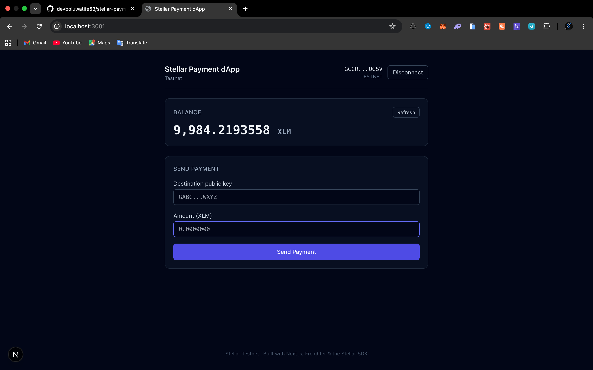
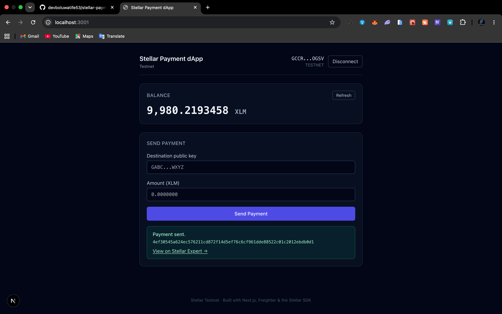
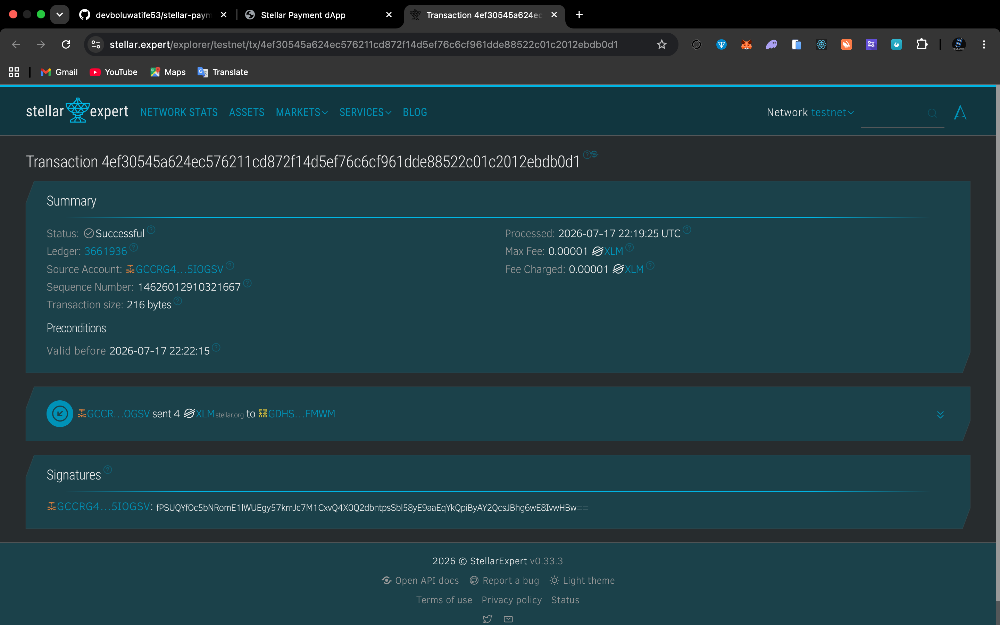

# Stellar Payment dApp

A simple single-page dApp for **Stellar Testnet**: connect your Freighter
wallet, view your XLM balance, and send an XLM payment to any Stellar public
key.

> **Hackathon track:** Level 1 — White Belt

## What it does

- **Connect / disconnect** a Freighter wallet (disconnect is client-side only,
  since Freighter has no true disconnect).
- Detects when Freighter isn't installed and links to the install page.
- Verifies the wallet is on **Testnet** and warns if it isn't.
- Fetches and displays the account's **XLM balance** from Horizon testnet, with
  loading and refresh states.
- Handles **unfunded accounts** — offers a one-click Friendbot funding button.
- **Sends XLM payments**: validates the destination key and amount, builds the
  transaction with the Stellar SDK, signs it via Freighter, and submits it to
  Horizon.
- Shows clear transaction feedback — submitting, success (with hash + Stellar
  Expert link), or a readable failure message parsed from Horizon.
- Auto-refreshes the balance after a successful send.

## Tech stack

| Layer          | Choice                                        |
| -------------- | --------------------------------------------- |
| Framework      | Next.js (App Router, TypeScript)              |
| Styling        | Tailwind CSS                                  |
| Wallet         | Freighter (`@stellar/freighter-api`)          |
| Chain SDK      | `@stellar/stellar-sdk`                        |
| Network        | Stellar Testnet via Horizon                   |
| Explorer       | Stellar Expert (testnet)                      |

## Project structure

```
app/
  layout.tsx          Root layout
  page.tsx            Single-page UI, wires hooks + components
  globals.css         Tailwind + base styles
components/
  WalletBar.tsx       Header: connect/disconnect, address, network
  BalanceCard.tsx     Balance display, refresh, Friendbot funding
  SendPaymentForm.tsx Payment form, validation, tx feedback
  Alert.tsx           Shared alert/notice component
hooks/
  useWallet.ts        Freighter connection + network state
  useBalance.ts       Balance fetching + Friendbot funding
lib/
  constants.ts        Network config (from env), explorer URLs
  freighter.ts        Freighter API wrappers (normalized errors)
  stellar.ts          Balance fetch, tx build/submit, error parsing, validation
  format.ts           Address truncation + XLM formatting
```

## Prerequisites

- **Node.js 18.18+** (Node 20+ recommended)
- **Freighter** browser extension — install from
  [freighter.app](https://www.freighter.app/)

## Setup

```bash
# 1. Install dependencies
npm install

# 2. (Optional) configure env — defaults already target Testnet
cp .env.example .env.local

# 3. Run the dev server
npm run dev
```

Then open [http://localhost:3000](http://localhost:3000).

### Environment variables

All are optional — the app defaults to Testnet. See `.env.example`.

| Variable                          | Default                                 |
| --------------------------------- | --------------------------------------- |
| `NEXT_PUBLIC_HORIZON_URL`         | `https://horizon-testnet.stellar.org`   |
| `NEXT_PUBLIC_NETWORK_PASSPHRASE`  | `Test SDF Network ; September 2015`     |
| `NEXT_PUBLIC_FRIENDBOT_URL`       | `https://friendbot.stellar.org`         |

## Using the app

### Switch Freighter to Testnet

1. Open the Freighter extension.
2. Open the network dropdown (top of the popup).
3. Select **Test Net**.

The app warns you at the top if Freighter is on a different network.

### Fund a testnet account via Friendbot

New accounts don't exist on-chain until funded. When you connect an unfunded
account, the app shows a **Fund with Friendbot** button that grants 10,000 test
XLM. You can also fund manually:

```
https://friendbot.stellar.org/?addr=YOUR_PUBLIC_KEY
```

## Screenshots

### 1. Wallet connected
<!--  -->
_Placeholder — wallet connected state with truncated address in the header._

### 2. Balance displayed


### 3. Successful transaction


## Example transaction

A successful payment sent with this dApp on Stellar Testnet:

- **Hash:** `4ef30545a624ec576211cd872f14d5ef76c6cf961dde88522c01c2012ebdb0d1`
- **View on Stellar Expert:**
  [testnet/tx/4ef30545…b0d1](https://stellar.expert/explorer/testnet/tx/4ef30545a624ec576211cd872f14d5ef76c6cf961dde88522c01c2012ebdb0d1)

On-chain proof of the transaction:



## Notes

- A small reserve buffer (~1 XLM) is held back from the spendable balance to
  cover the account's minimum reserve and transaction fee.
- Horizon error result codes (e.g. `op_underfunded`, `op_no_destination`) are
  translated into plain-English messages rather than raw JSON.
