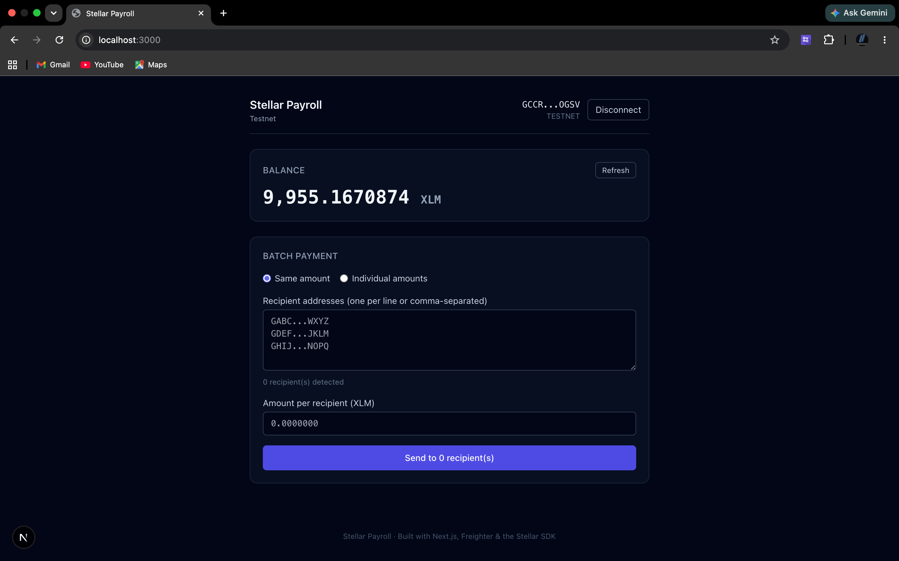
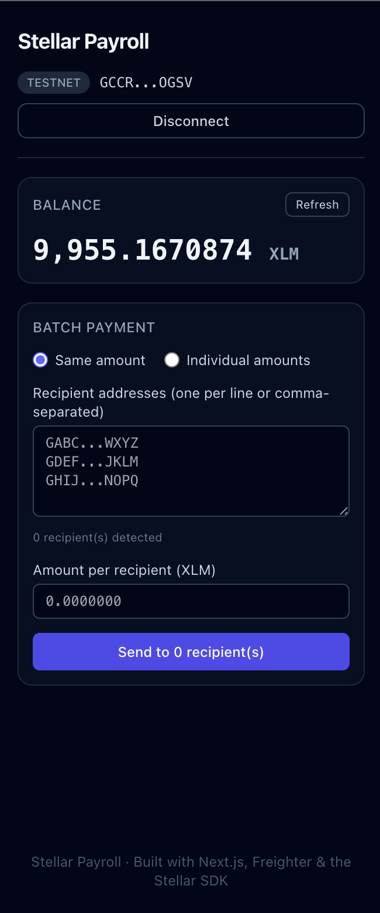
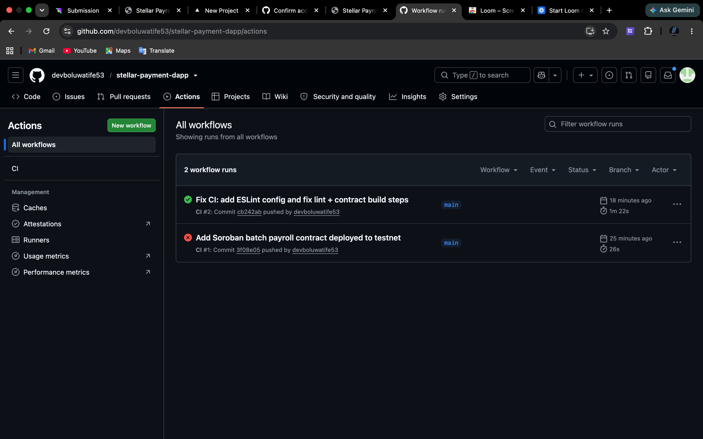
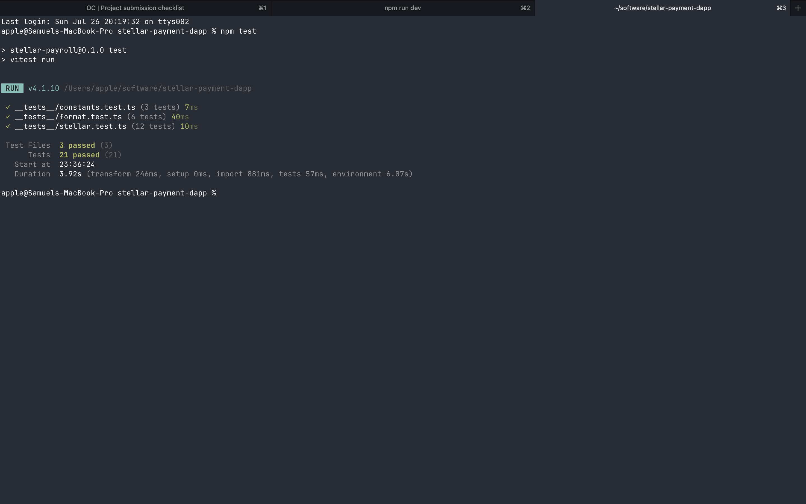

# Stellar Payroll

[](https://github.com/devboluwatife53/stellar-payment-dapp/actions/workflows/ci.yml)

A batch payment dApp for **Stellar Testnet** — connect your Freighter wallet,
add multiple recipients, and send payroll in a single transaction.

## Live Demo

🔗 [https://stellar-payroll.vercel.app](https://stellar-payroll.vercel.app)

## Demo Video

📹 [Watch the 2-minute walkthrough](https://youtu.be/your-video-id)

## What it does

- **Connect / disconnect** a Freighter wallet with automatic Testnet detection.
- **Batch payments** — paste 1–20 recipient addresses (comma or newline
  separated) and send XLM to all of them in one atomic transaction.
- **Two payment modes** — send the same amount to every recipient, or specify
  individual amounts per recipient (`GABC... 10.5`).
- **Live total preview** — see the total XLM that will be debited before you
  confirm.
- **Transaction history** — every batch payment is recorded in-session with
  recipient details, amounts, timestamps, and Stellar Expert links.
- **Unfunded account handling** — one-click Friendbot funding to get 10,000
  test XLM.
- Clear transaction feedback with hashes and links to
  [Stellar Expert](https://stellar.expert).

## Smart Contract

A Soroban smart contract for on-chain batch payroll record-keeping is deployed
on Stellar Testnet:

| Item | Value |
|------|-------|
| **Contract Address** | [`CC5MICUKQBZ736HE5ECZF3OQ3DZWRTRZSIDWYZK4Y2IQMOCPN5JAQC23`](https://stellar.expert/explorer/testnet/contract/CC5MICUKQBZ736HE5ECZF3OQ3DZWRTRZSIDWYZK4Y2IQMOCPN5JAQC23) |
| **Deployment TX** | [`4b3aa333...9be7ef`](https://stellar.expert/explorer/testnet/tx/4b3aa333788326f3b51b06a9bbb20a70ff9fd67c9387b679d6e42d72c99be7ef) |
| **WASM Upload TX** | [`9545092f...1cb59`](https://stellar.expert/explorer/testnet/tx/9545092f9aa7895d2faa9280a4078443997258d906682522c359eb4516f1cb59) |
| **Initialization TX** | [`e8429dda...fa702`](https://stellar.expert/explorer/testnet/tx/e8429dda313a69b0b99995033d4461571642c45fb7af79a54d0b0db274ffa702) |
| **Network** | Stellar Testnet |

### Contract Functions

- `initialize(admin)` — set the contract admin
- `record_batch(payer, recipients, amounts)` — record a batch payroll run on-chain
- `get_payment_history()` — retrieve all recorded payments
- `total_paid()` — total XLM ever processed
- `payment_count()` — number of individual payments recorded

## Tech stack

| Layer | Choice |
|-------|--------|
| Framework | Next.js (App Router, TypeScript) |
| Styling | Tailwind CSS |
| Wallet | Freighter (`@stellar/freighter-api`) |
| Chain SDK | `@stellar/stellar-sdk` |
| Smart Contract | Soroban (Rust) |
| Network | Stellar Testnet via Horizon |
| Explorer | Stellar Expert (testnet) |

## Project structure

```
app/
  layout.tsx          Root layout
  page.tsx            Single-page UI, wires hooks + components
  globals.css         Tailwind + base styles
components/
  WalletBar.tsx       Header: connect/disconnect, address, network
  BalanceCard.tsx     Balance display, refresh, Friendbot funding
  BatchPaymentForm.tsx  Multi-recipient payment form with batch logic
  TransactionHistory.tsx  Session transaction history with details
  Alert.tsx           Shared alert/notice component
hooks/
  useWallet.ts        Freighter connection + network state
  useBalance.ts       Balance fetching + Friendbot funding
lib/
  constants.ts        Network config (from env), explorer URLs
  freighter.ts        Freighter API wrappers (normalized errors)
  stellar.ts          Balance fetch, batch tx build/submit, validation
  format.ts           Address truncation + XLM formatting
contracts/
  batch_payroll/      Soroban smart contract for on-chain payroll records
    src/lib.rs        Contract implementation
    Cargo.toml        Rust dependencies
```

## Prerequisites

- **Node.js 18.18+** (Node 20+ recommended)
- **Freighter** browser extension — install from
  [freighter.app](https://www.freighter.app/)

## Setup

```bash
# 1. Install dependencies
npm install

# 2. (Optional) configure env — defaults already target Testnet
cp .env.example .env.local

# 3. Run the dev server
npm run dev
```

Then open [http://localhost:3000](http://localhost:3000).

### Environment variables

All are optional — the app defaults to Testnet. See `.env.example`.

| Variable | Default |
|----------|---------|
| `NEXT_PUBLIC_HORIZON_URL` | `https://horizon-testnet.stellar.org` |
| `NEXT_PUBLIC_NETWORK_PASSPHRASE` | `Test SDF Network ; September 2015` |
| `NEXT_PUBLIC_FRIENDBOT_URL` | `https://friendbot.stellar.org` |

## Using the app

### Switch Freighter to Testnet

1. Open the Freighter extension.
2. Open the network dropdown (top of the popup).
3. Select **Test Net**.

The app warns you at the top if Freighter is on a different network.

### Send a batch payment

1. Connect your Freighter wallet.
2. Choose a payment mode:
   - **Same amount** — enter recipient addresses and a single XLM amount.
   - **Individual amounts** — enter `GABC...WXYZ 10.5` per line.
3. Review the total preview.
4. Click **Send to N recipient(s)** and confirm in Freighter.

### Fund a testnet account via Friendbot

New accounts don't exist on-chain until funded. When you connect an unfunded
account, the app shows a **Fund with Friendbot** button that grants 10,000 test
XLM.

## Screenshots

### Main UI


### Mobile View


### CI Pipeline


### Test Output



## Example transaction

A successful batch payment sent with this dApp on Stellar Testnet:

- **Hash:** `4ef30545a624ec576211cd872f14d5ef76c6cf961dde88522c01c2012ebdb0d1`
- **View on Stellar Expert:**
  [testnet/tx/4ef30545…b0d1](https://stellar.expert/explorer/testnet/tx/4ef30545a624ec576211cd872f14d5ef76c6cf961dde88522c01c2012ebdb0d1)

## Notes

- Batch payments use Stellar multi-operation transactions — all payments in a
  batch are atomic (all succeed or all fail).
- A small reserve buffer (~1 XLM) is held back from the spendable balance to
  cover the account's minimum reserve and transaction fees.
- Transaction fees scale with the number of recipients (100 stroops per
  operation).
- Transaction history is stored in session memory and resets on page reload.
